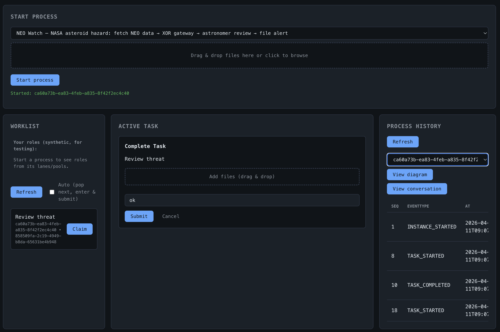

<div align="center">


# in concert

**BPMN 2.0 EXECUTION ENGINE**

*BY THE REAL INSIGHT GMBH*

---

**A production-grade BPMN 2.0 execution engine for Node.js**

*Event-sourced · Optimistic concurrency · Push-style callbacks · REST & embedded*

[](https://www.npmjs.com/package/@the-real-insight/in-concert)
[](./LICENSE)
[](https://nodejs.org)
[](https://www.typescriptlang.org)
[](https://github.com/The-Real-Insight/in-concert/actions/workflows/test.yml)

<br/>

[**Get started →**](#quick-start) · [**Documentation**](./docs/README.md) · [**npm**](https://www.npmjs.com/package/@the-real-insight/in-concert) · [**Contributing**](./docs/contributing.md)

</div>

---

## What is this?

**in-concert** executes **BPMN 2.0 process definitions** in Node.js. It is not a visual modeler or a full Camunda/Flowable replacement — it is a focused, embeddable runtime that covers the BPMN subset most production workflows actually need.

```
BPMN file ──▶ in-concert ──▶ Event-sourced instance
                   │
                   ├── REST + WebSocket (microservice mode)
                   └── Local MongoDB   (embedded / test mode)
```

Built for teams who want **deterministic, inspectable process execution** without the weight of a full BPM platform.

> **Powered by [The Real Insight GmbH](https://the-real-insight.com)**

---

## Highlights

| | |
|---|---|
| 🔁 **Event-sourced instances** | Every token move is an event. Replay, audit, and debug any instance from its stream. |
| ⚡ **Optimistic concurrency** | Safe parallel execution without pessimistic locking. |
| 📬 **Push-style callbacks** | Human tasks, service tasks, and gateway decisions delivered via WebSocket — no polling. |
| 🔌 **Two integration modes** | **REST mode** (HTTP + WebSocket) for microservices, **local mode** (direct MongoDB) for tests and embedding. |
| 📋 **Worklist built in** | Human tasks projected to `/v1/tasks` with claim, activate, and complete flows out of the box. |
| 🎯 **Honest scope** | A [well-defined BPMN subset](./readme/REQUIREMENTS.md) — no hidden surprises, no partially-supported elements. |

---

## A real process, running live

The diagram below is a working BPMN 2.0 process executed by in-concert. It calls the NASA Near-Earth Object API, routes on the result through an XOR gateway, and hands off to a human reviewer when a hazardous object is detected — all with your logic, your storage, and your services wired in from outside the engine.


→ [Full walkthrough with code](./docs/getting-started.md)

---

## Quick Start

**Prerequisites:** Node.js 18+, MongoDB

```bash
npm install @the-real-insight/in-concert
```

in-concert supports two integration modes. The API is identical — only initialisation differs.

**Remote mode** is the right choice when you want to scale the engine independently as a microservice, share it across multiple applications, or keep process execution decoupled from your business logic. The engine runs as a standalone HTTP + WebSocket server; your application connects via the SDK.

**Server side** — the engine exposes a REST API and a WebSocket endpoint. Configure it via environment variables and start it with Node:

```bash
# .env
MONGO_URL=mongodb://localhost:27017
MONGO_BPM_DB=in-concert
PORT=3000
```

```bash
node node_modules/@the-real-insight/in-concert/dist/index.js
```

The engine is now listening on `:3000` — REST API under `/v1`, WebSocket at `/ws`.

**Client side** — connect from any Node.js application using the SDK:

```typescript
import { BpmnEngineClient } from '@the-real-insight/in-concert/sdk';

const client = new BpmnEngineClient({
  mode: 'rest',
  baseUrl: 'http://localhost:3000',
});
```

Alternatively, **local mode** embeds the engine directly in your process — no server, no network hop. It runs against MongoDB in-process, which makes it ideal for testing, serverless functions, or applications where co-location matters more than scale-out.

You can initialise for embedded use like this:

```typescript
import { BpmnEngineClient } from '@the-real-insight/in-concert/sdk';
import { connectDb, ensureIndexes } from '@the-real-insight/in-concert/db';

const db = await connectDb('mongodb://localhost:27017/in-concert');
await ensureIndexes(db);

const client = new BpmnEngineClient({ mode: 'local', db });
```

### Handlers — keeping your logic outside the engine

in-concert does not execute your business logic. Instead, it notifies your code when the process needs something, and waits. This is a deliberate design choice: your data, your documents, your services, and your routing decisions all live outside the engine. The process instance id is the binding key — use it to correlate any external state.

This means your handlers can do anything: make a REST call, publish to a message queue and await the reply, poll an external system, query your own database to evaluate a condition, or map data from your domain model into the result. The engine does not care how long it takes or how you get there.

Register your handlers once at startup:

```typescript
client.init({
  // Called when a service task is reached.
  // Your code calls the service — sync, async, queue-based, whatever fits.
  // Use instanceId to bind results back to this process instance.
  onServiceCall: async ({ instanceId, payload }) => {
    const result = await myService.execute(payload.extensions?.toolId, {
      processInstanceId: instanceId,
      ...myDataStore.getContextFor(instanceId),
    });
    await client.completeExternalTask(instanceId, payload.workItemId, { result });
  },

  // Called when an XOR gateway needs a routing decision.
  // Evaluate the condition in your own code, against your own data.
  // The engine never sees your domain objects — only the selected flow id.
  onDecision: async ({ instanceId, payload }) => {
    const context = await myDataStore.getContextFor(instanceId);
    const selected = myRouter.evaluate(payload.transitions, context);
    await client.submitDecision(instanceId, payload.decisionId, {
      selectedFlowIds: [selected.flowId],
    });
  },
});

// Deploy a BPMN definition
const { definitionId } = await client.deploy({
  id: 'order-process',
  name: 'Order Process',
  version: '1',
  bpmnXml: myBpmnXml,
});

// Start an instance
const { instanceId } = await client.startInstance({
  commandId: crypto.randomUUID(),
  definitionId,
});

// REST mode: subscribe via WebSocket — no polling
client.subscribeToCallbacks((item) => console.log(item.kind, item.instanceId));

// Local mode: run to completion inline
const { status } = await client.run(instanceId);
console.log(status); // COMPLETED | FAILED | TERMINATED
```

### Worklist — building task-driven UIs

in-concert projects human tasks into a queryable worklist, giving you the flexibility to build any interaction model your product needs. Tasks can be filtered by role, by the user who has claimed them, by process instance, or by status — so you can support cherry-picking (users browse open tasks and self-assign), supervisor assignment (a manager picks who does what), or fully automated routing.

**Fetching tasks for a user** returns all open tasks matching that user's roles, plus any tasks they have already claimed:

```typescript
const tasks = await client.getWorklistForUser({
  userId: user._id,
  roleIds: user.roleAssignments.map(ra => String(ra.role)),
});
```

**Claiming a task** locks it for that user, preventing others from picking it up simultaneously:

```typescript
await client.activateTask(taskId, { userId: user._id });
```

You can also query more broadly — by instance, status, or assignee — to build supervisor views or audit dashboards:

```typescript
const allOpen    = await client.listTasks({ status: 'OPEN' });
const myInstance = await client.listTasks({ instanceId });
const claimedBy  = await client.listTasks({ userId: user._id });
```

**Completing a task** advances the process. Pass the result and user for a full audit trail:

```typescript
await client.completeUserTask(instanceId, workItemId, {
  result: { approved: true, comment: 'Looks good' },
  user: { email: user.email },
});
```

> Full API reference → [SDK usage guide](./docs/sdk/usage.md)

### See it all in action

The [NASA Near-Earth Object Watch](./docs/getting-started.md) is a complete, copy-paste-ready example that wires up every concept above in a single file: a live NASA API call, an XOR gateway routing on the result, an astronomer review task working through the worklist, and a full audit trail. If you want to understand how in-concert fits together in practice, start there.

---

## Test portal

The engine ships with a browser-based **process portal** for hands-on testing. Deploy a process, start instances, claim and complete human tasks, and inspect the full event history — no application code required.

```bash
npm run server
# opens at http://localhost:9100
```



The portal shows the complete interaction cycle: start a process (top), claim tasks from the worklist (left), complete them with a response and optional file attachments (centre), and trace every engine event in the process history (right). It is the fastest way to verify a BPMN model end-to-end before wiring up integrations.

Step-by-step walkthrough with the NEO Watch process: [Getting started — Test portal](./docs/getting-started.md#running-the-process-in-the-test-portal)

---

## HTTP API

The engine exposes a REST API under `/v1`. Key endpoints:

```
POST   /v1/definitions                              Deploy a BPMN file
POST   /v1/instances                                Start a process instance
GET    /v1/instances/:id                            Get instance
GET    /v1/instances/:id/state                      Get execution state
POST   /v1/instances/:id/work-items/:wid/complete   Complete a work item
POST   /v1/instances/:id/decisions/:did             Resolve an XOR gateway
GET    /v1/tasks                                    Worklist query
WS     /ws                                          Push callbacks (REST mode)
```

Full reference → [SDK usage guide](./docs/sdk/usage.md)

---

## Documentation

| Guide | Description |
|---|---|
| [Getting started](./docs/getting-started.md) | Environment setup, ports, install, test commands |
| [SDK overview](./docs/sdk/README.md) | Entry points, REST vs local mode, `TriSdk` facade |
| [SDK usage (full reference)](./docs/sdk/usage.md) | API reference, callbacks, WebSocket, worklist |
| [Browser demo](./docs/test-ui.md) | Interactive test UI (`npm run server`) |
| [Testing](./docs/testing.md) | Jest targets and conformance pointers |
| [Database schema](./docs/database-schema.md) | MongoDB hub; canonical tables in `readme/database-schema.md` |
| [Contributing](./docs/contributing.md) | How to contribute |

Design & internals:

- [BPMN subset & requirements](./readme/REQUIREMENTS.md)
- [MongoDB database schema](./readme/database-schema.md) — collections, fields, types, semantics, indexes
- [Conformance matrix](./readme/TEST.md)

---

## BPMN Support

in-concert implements a curated BPMN 2.0 subset. See the full [conformance matrix](./readme/TEST.md) for details. Unsupported elements fail fast and loudly — never silently.

**Supported:** Start/End events · Service tasks · User tasks · Script tasks · XOR gateways · Parallel gateways · Sequence flows · Boundary events · Sub-processes

**Not in scope (yet):** Compensation · Complex gateways · Choreography · Conversation

---

## Contributing

Issues and pull requests are welcome. Please read [docs/contributing.md](./docs/contributing.md) and run tests before submitting:

```bash
npm run test:unit          # fast unit tests
npm run test:conformance   # BPMN conformance suite
```

---

## License

Copyright © 2024-present **[The Real Insight GmbH](https://the-real-insight.com)**

This project is released under a **modified MIT license with attribution requirements**. See [LICENSE](./LICENSE) for the full text.

**In short:** You may use, copy, modify, and distribute this software freely — with three conditions:

> 1. The engine's **startup log notice** identifying The Real Insight GmbH must not be removed or suppressed.
> 2. Any **end-user product** built on this engine must credit The Real Insight GmbH in its imprint, About page, or terms and conditions.
> 3. Any **documentation or README** accompanying a derivative must include a "Powered by" attribution.

---

<div align="center">

Built with care by **[The Real Insight GmbH](https://the-real-insight.com)**

*The creators of Agentic BPM.*

</div>