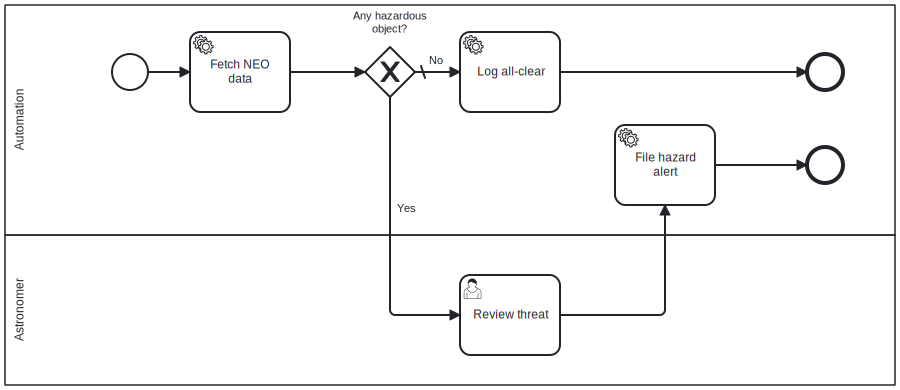

# Getting started

**Powered by The Real Insight GmbH BPMN Engine ([the-real-insight.com](https://the-real-insight.com)).**

This guide is a complete, runnable example. Every pattern from the README — external storage, service task handlers, XOR decision routing, human task worklist — is implemented concretely, so you can copy and adapt it.

The scenario: **NASA Near-Earth Object (NEO) Watch** — a workflow that fetches today's asteroid data from the NASA public API, finds the closest-approaching object, routes to a human reviewer if it passes within 5 million km, then files an alert or logs all-clear. There is almost always at least one object within that range on any given day, so the review path fires regularly.

---

## The process

```
Start
  └─▶ Fetch NEO data     (service task — calls NASA API, stores result)
          └─▶ [Hazardous?]    (XOR gateway — your code reads the result and routes)
                ├─ Yes ─▶ Review threat    (user task — astronomer inbox)
                │               └─▶ File hazard alert   (service task)
                │                             └─▶ End
                └─ No  ─▶ Log all-clear    (service task)
                                └─▶ End
```

This covers all the key patterns: **service task**, **XOR decision** backed by external data, and **human task** with worklist routing.

---

## Step 1 — Install

```bash
npm install @the-real-insight/in-concert
```

**Prerequisites:** Node.js 18+, MongoDB.

---

## Step 2 — The BPMN process model



Save this as `neo-watch.bpmn` (also available in the repo as `test/bpmn/neo-watch.bpmn`):

```xml
<?xml version="1.0" encoding="UTF-8"?>
<bpmn:definitions
  xmlns:xsi="http://www.w3.org/2001/XMLSchema-instance"
  xmlns:bpmn="http://www.omg.org/spec/BPMN/20100524/MODEL"
  xmlns:bpmndi="http://www.omg.org/spec/BPMN/20100524/DI"
  xmlns:dc="http://www.omg.org/spec/DD/20100524/DC"
  xmlns:di="http://www.omg.org/spec/DD/20100524/DI"
  xmlns:tri="http://tri.com/schema/bpmn"
  id="Defs_NeoWatch"
  targetNamespace="http://example.com/bpmn">

  <bpmn:process id="Process_NeoWatch" isExecutable="true">

    <bpmn:laneSet id="LaneSet_1">
      <bpmn:lane id="Lane_Automation" name="Automation">
        <bpmn:flowNodeRef>Start</bpmn:flowNodeRef>
        <bpmn:flowNodeRef>Task_FetchNeo</bpmn:flowNodeRef>
        <bpmn:flowNodeRef>Gateway_Hazardous</bpmn:flowNodeRef>
        <bpmn:flowNodeRef>Task_FileAlert</bpmn:flowNodeRef>
        <bpmn:flowNodeRef>Task_LogAllClear</bpmn:flowNodeRef>
        <bpmn:flowNodeRef>End</bpmn:flowNodeRef>
      </bpmn:lane>
      <bpmn:lane id="Lane_Astronomer" name="Astronomer">
        <bpmn:flowNodeRef>Task_ReviewThreat</bpmn:flowNodeRef>
      </bpmn:lane>
    </bpmn:laneSet>

    <bpmn:startEvent id="Start"/>

    <bpmn:serviceTask id="Task_FetchNeo" name="Fetch NEO data"
      tri:toolId="fetch-neo-data"/>

    <bpmn:exclusiveGateway id="Gateway_Hazardous" name="Close approach?"
      default="Flow_AllClear"/>

    <bpmn:userTask id="Task_ReviewThreat" name="Review threat"/>

    <bpmn:serviceTask id="Task_FileAlert" name="File hazard alert"
      tri:toolId="file-alert"/>

    <bpmn:serviceTask id="Task_LogAllClear" name="Log all-clear"
      tri:toolId="log-all-clear"/>

    <bpmn:endEvent id="End"/>

    <bpmn:sequenceFlow id="Flow_1"         sourceRef="Start"             targetRef="Task_FetchNeo"/>
    <bpmn:sequenceFlow id="Flow_2"         sourceRef="Task_FetchNeo"     targetRef="Gateway_Hazardous"/>
    <bpmn:sequenceFlow id="Flow_Hazardous" name="Yes"
      sourceRef="Gateway_Hazardous" targetRef="Task_ReviewThreat">
      <bpmn:conditionExpression xsi:type="tFormalExpression"><![CDATA[${hazardous}]]></bpmn:conditionExpression>
    </bpmn:sequenceFlow>
    <bpmn:sequenceFlow id="Flow_AllClear"  name="No"
      sourceRef="Gateway_Hazardous" targetRef="Task_LogAllClear"/>
    <bpmn:sequenceFlow id="Flow_3"         sourceRef="Task_ReviewThreat" targetRef="Task_FileAlert"/>
    <bpmn:sequenceFlow id="Flow_4"         sourceRef="Task_FileAlert"    targetRef="End"/>
    <bpmn:sequenceFlow id="Flow_5"         sourceRef="Task_LogAllClear"  targetRef="End"/>

  </bpmn:process>

  <bpmndi:BPMNDiagram id="BPMNDiagram_NeoWatch">
    <bpmndi:BPMNPlane id="BPMNPlane_NeoWatch" bpmnElement="Process_NeoWatch">
      <bpmndi:BPMNShape id="Lane_Automation_di" bpmnElement="Lane_Automation" isHorizontal="true">
        <dc:Bounds x="30" y="30" width="840" height="135"/>
      </bpmndi:BPMNShape>
      <bpmndi:BPMNShape id="Lane_Astronomer_di" bpmnElement="Lane_Astronomer" isHorizontal="true">
        <dc:Bounds x="30" y="165" width="840" height="135"/>
      </bpmndi:BPMNShape>
      <bpmndi:BPMNShape id="Start_di" bpmnElement="Start">
        <dc:Bounds x="137" y="79" width="36" height="36"/>
      </bpmndi:BPMNShape>
      <bpmndi:BPMNShape id="Task_FetchNeo_di" bpmnElement="Task_FetchNeo">
        <dc:Bounds x="215" y="57" width="100" height="80"/>
      </bpmndi:BPMNShape>
      <bpmndi:BPMNShape id="Gateway_Hazardous_di" bpmnElement="Gateway_Hazardous" isMarkerVisible="true">
        <dc:Bounds x="390" y="72" width="50" height="50"/>
        <bpmndi:BPMNLabel>
          <dc:Bounds x="368" y="129" width="94" height="27"/>
        </bpmndi:BPMNLabel>
      </bpmndi:BPMNShape>
      <bpmndi:BPMNShape id="Task_LogAllClear_di" bpmnElement="Task_LogAllClear">
        <dc:Bounds x="485" y="57" width="100" height="80"/>
      </bpmndi:BPMNShape>
      <bpmndi:BPMNShape id="Task_FileAlert_di" bpmnElement="Task_FileAlert">
        <dc:Bounds x="615" y="57" width="100" height="80"/>
      </bpmndi:BPMNShape>
      <bpmndi:BPMNShape id="End_di" bpmnElement="End">
        <dc:Bounds x="772" y="79" width="36" height="36"/>
      </bpmndi:BPMNShape>
      <bpmndi:BPMNShape id="Task_ReviewThreat_di" bpmnElement="Task_ReviewThreat">
        <dc:Bounds x="490" y="192" width="100" height="80"/>
      </bpmndi:BPMNShape>
      <bpmndi:BPMNEdge id="Flow_1_di" bpmnElement="Flow_1">
        <di:waypoint x="173" y="97"/>
        <di:waypoint x="215" y="97"/>
      </bpmndi:BPMNEdge>
      <bpmndi:BPMNEdge id="Flow_2_di" bpmnElement="Flow_2">
        <di:waypoint x="315" y="97"/>
        <di:waypoint x="390" y="97"/>
      </bpmndi:BPMNEdge>
      <bpmndi:BPMNEdge id="Flow_Hazardous_di" bpmnElement="Flow_Hazardous">
        <di:waypoint x="415" y="122"/>
        <di:waypoint x="415" y="232"/>
        <di:waypoint x="490" y="232"/>
        <bpmndi:BPMNLabel>
          <dc:Bounds x="422" y="172" width="18" height="14"/>
        </bpmndi:BPMNLabel>
      </bpmndi:BPMNEdge>
      <bpmndi:BPMNEdge id="Flow_AllClear_di" bpmnElement="Flow_AllClear">
        <di:waypoint x="440" y="97"/>
        <di:waypoint x="485" y="97"/>
        <bpmndi:BPMNLabel>
          <dc:Bounds x="454" y="79" width="15" height="14"/>
        </bpmndi:BPMNLabel>
      </bpmndi:BPMNEdge>
      <bpmndi:BPMNEdge id="Flow_3_di" bpmnElement="Flow_3">
        <di:waypoint x="590" y="232"/>
        <di:waypoint x="665" y="232"/>
        <di:waypoint x="665" y="137"/>
      </bpmndi:BPMNEdge>
      <bpmndi:BPMNEdge id="Flow_4_di" bpmnElement="Flow_4">
        <di:waypoint x="715" y="97"/>
        <di:waypoint x="772" y="97"/>
      </bpmndi:BPMNEdge>
      <!-- LogAllClear → End routed above the task row to avoid crossing FileAlert -->
      <bpmndi:BPMNEdge id="Flow_5_di" bpmnElement="Flow_5">
        <di:waypoint x="585" y="97"/>
        <di:waypoint x="585" y="44"/>
        <di:waypoint x="790" y="44"/>
        <di:waypoint x="790" y="79"/>
      </bpmndi:BPMNEdge>
    </bpmndi:BPMNPlane>
  </bpmndi:BPMNDiagram>

</bpmn:definitions>
```

Two things to note:

- **`tri:toolId`** on service tasks is how your handlers identify which task fired. You define the values — the engine passes them back in `payload.extensions['tri:toolId']`.
- **`default="Flow_AllClear"`** on the gateway means the all-clear path is taken unless your `onDecision` handler explicitly selects `Flow_Hazardous`. Your code decides — the engine never evaluates `${hazardous}` itself.

---

## Step 3 — The complete example

Create `neo-watch.ts`:

```typescript
import { readFileSync } from 'node:fs';
import { randomUUID } from 'node:crypto';
import { BpmnEngineClient } from '@the-real-insight/in-concert/sdk';
import { connectDb, ensureIndexes } from '@the-real-insight/in-concert/db';

// ── Storage ───────────────────────────────────────────────────────────────────
//
// The engine never stores or reads your domain data.
// You own the storage; instanceId is the only binding key.

interface NeoScanResult {
  date: string;
  closestObject: { id: string; name: string; missDistanceKm: number; isHazardous: boolean } | null;
  requiresReview: boolean;  // true when closest approach is within REVIEW_THRESHOLD_KM
}

const store = new Map<string, NeoScanResult>();

// Trigger a review when the closest object passes within this distance.
// ~1 lunar distance is 384,400 km — a reasonable "worth a look" threshold.
// There is almost always at least one object within 5 M km on any given day.
const REVIEW_THRESHOLD_KM = 5_000_000;

// ── NASA API ──────────────────────────────────────────────────────────────────
//
// Fully public — no account needed in development (DEMO_KEY: 30 req/hr).
// Register a free key at https://api.nasa.gov for production use.

async function fetchNeoData(date: string): Promise<NeoScanResult> {
  const url =
    `https://api.nasa.gov/neo/rest/v1/feed` +
    `?start_date=${date}&end_date=${date}&api_key=DEMO_KEY`;

  const res = await fetch(url);
  if (!res.ok) throw new Error(`NASA API ${res.status}: ${await res.text()}`);

  const data = (await res.json()) as Record<string, any>;
  const objects: any[] = data.near_earth_objects?.[date] ?? [];

  // Pick the closest-approaching object — there is always at least one.
  const closest = objects
    .map(o => ({
      id: String(o.id),
      name: String(o.name),
      missDistanceKm: Math.round(
        parseFloat(o.close_approach_data?.[0]?.miss_distance?.kilometers ?? '0')
      ),
      isHazardous: Boolean(o.is_potentially_hazardous_asteroid),
    }))
    .sort((a, b) => a.missDistanceKm - b.missDistanceKm)[0] ?? null;

  return {
    date,
    closestObject: closest,
    requiresReview: closest !== null && closest.missDistanceKm < REVIEW_THRESHOLD_KM,
  };
}

// ── Engine setup ──────────────────────────────────────────────────────────────

const db = await connectDb(
  process.env.MONGO_URL ?? 'mongodb://localhost:27017/in-concert'
);
await ensureIndexes(db);

const client = new BpmnEngineClient({ mode: 'local', db });

client.init({
  // Called for every service task.
  // Dispatch on tri:toolId, perform the real work, complete the work item.
  onServiceCall: async ({ instanceId, payload }) => {
    const toolId = payload.extensions?.['tri:toolId'];

    if (toolId === 'fetch-neo-data') {
      const date = new Date().toISOString().slice(0, 10);
      const result = await fetchNeoData(date);

      // Store under instanceId — the engine never sees this object.
      store.set(instanceId, result);

      const { closestObject, requiresReview } = result;
      console.log(
        `[${instanceId}] Closest approach on ${result.date}:`,
        closestObject
          ? `${closestObject.name} at ${closestObject.missDistanceKm.toLocaleString()} km` +
            (requiresReview ? ' — REVIEW REQUIRED' : ' — no review needed')
          : 'no objects today'
      );

      await client.completeExternalTask(instanceId, payload.workItemId);
    }

    if (toolId === 'file-alert') {
      const { closestObject } = store.get(instanceId)!;
      // In production: open an incident ticket, page the on-call astronomer, etc.
      console.log(`[${instanceId}] CLOSE APPROACH ALERT filed:`, closestObject);
      await client.completeExternalTask(instanceId, payload.workItemId);
    }

    if (toolId === 'log-all-clear') {
      const { date, closestObject } = store.get(instanceId)!;
      console.log(
        `[${instanceId}] All clear on ${date}.`,
        closestObject ? `Closest: ${closestObject.name} at ${closestObject.missDistanceKm.toLocaleString()} km.` : ''
      );
      await client.completeExternalTask(instanceId, payload.workItemId);
    }
  },

  // Called when the XOR gateway needs a routing decision.
  // Read your stored context. Pick a flow. The engine advances the token.
  // The condition expression in the BPMN (${requiresReview}) is documentation only —
  // your code here is what actually routes.
  onDecision: async ({ instanceId, payload }) => {
    const { requiresReview } = store.get(instanceId)!;

    // payload.transitions lists every outgoing sequence flow:
    //   { flowId, name, isDefault, conditionExpression, targetNodeName }
    // Pick the one matching your domain condition.
    const selected =
      payload.transitions.find(t => (requiresReview ? !t.isDefault : t.isDefault))
      ?? payload.transitions[0]!;

    console.log(
      `[${instanceId}] Gateway: ${requiresReview ? `close approach → review` : 'all clear (default)'}`
    );

    await client.submitDecision(instanceId, payload.decisionId, {
      selectedFlowIds: [selected.flowId],
    });
  },
});

// ── Deploy ────────────────────────────────────────────────────────────────────

const bpmnXml = readFileSync('./neo-watch.bpmn', 'utf8');

const { definitionId } = await client.deploy({
  id: 'neo-watch',
  name: 'NEO Watch',
  version: '1',
  bpmnXml,
  overwrite: true,
});

// ── Start and run ─────────────────────────────────────────────────────────────
//
// run() drives the instance through all pending callbacks (service tasks,
// decisions) until the process completes or pauses at a user task.
//
// It returns { status: 'COMPLETED' } on the all-clear path, or
// { status: 'RUNNING' } when paused at "Review threat".

const { instanceId } = await client.startInstance({
  commandId: randomUUID(),
  definitionId,
});

let result = await client.run(instanceId);
console.log('Status after automated steps:', result.status);

// ── Worklist — handle the human task if the hazardous path was taken ──────────

if (result.status === 'RUNNING') {
  // Query open tasks for this instance.
  // In local mode, listTasks reads the HumanTasks projection populated during run().
  const tasks = await client.listTasks({ instanceId, status: 'OPEN' });
  const reviewTask = tasks[0]!;
  console.log('Open task:', reviewTask.name); // "Review threat"

  // Astronomer claims the task (prevents double-claiming in multi-user setups).
  await client.activateTask(reviewTask._id, { userId: 'astronomer@agency.space' });

  // Astronomer submits their assessment. The result payload is yours — store it
  // however your application needs; the engine records it on the task document.
  await client.completeUserTask(instanceId, reviewTask._id, {
    result: {
      severity: 'LOW',
      comment: 'Miss distance > 1 M km. No action required at this time.',
    },
    user: { email: 'astronomer@agency.space' },
  });

  // Resume: engine advances to "File hazard alert" and then reaches End.
  result = await client.run(instanceId);
  console.log('Final status:', result.status); // COMPLETED
}
```

Run it:

```bash
npx tsx neo-watch.ts
# or: tsc && node neo-watch.js
```

---

## What each piece does

| Pattern | Where | What it shows |
|---|---|---|
| `store.set(instanceId, result)` | `onServiceCall` | Your data, your storage. `instanceId` is the only binding key. |
| `payload.extensions?.['tri:toolId']` | `onServiceCall` | How you identify which service task fired. Comes from `tri:toolId` in the BPMN. |
| `completeExternalTask(instanceId, workItemId)` | `onServiceCall` | Tells the engine the service task is done. Token advances. |
| `payload.transitions.find(...)` | `onDecision` | All outgoing flows are presented. Your code picks one based on domain logic. |
| `submitDecision(instanceId, decisionId, ...)` | `onDecision` | Commits the routing choice. The engine never evaluates BPMN condition expressions itself. |
| `client.run(instanceId)` | main | Drives the instance. Returns `RUNNING` when paused at a user task. |
| `listTasks / activateTask / completeUserTask` | main | The full worklist cycle: discover → claim → complete. |
| `client.run(instanceId)` again | main | Resumes from the user task. Call run whenever you want the engine to advance. |

---

## Running the process in the test portal

The **test portal** is a browser UI that ships with the engine. It lets you deploy, start, and work through processes manually — no code required. It is the fastest way to see a process in motion and verify routing before wiring up integrations.

### 1. Start the demo server

```bash
npm run server
```

Then open **[http://localhost:9100/](http://localhost:9100/)**.

*(screenshot — portal landing page)*

### 2. Set your test user

Fill in the **User** fields in the header (email, first name, last name). These are attached to task completions and the process audit trail so the history looks realistic.

*(screenshot — user fields in header)*

### 3. Load and start the NEO Watch process

1. In the **Start process** panel, choose **Local** as the model source.
2. Select **neo-watch** from the list — it is loaded from `test/bpmn/neo-watch.bpmn`.
3. Click **Start process**.

The engine deploys the definition (if not already deployed) and starts a new instance. The service tasks — *Fetch NEO data*, *File hazard alert*, and *Log all-clear* — are handled automatically by the demo server's built-in service task runner.

*(screenshot — Start process panel with neo-watch selected)*

### 4. Watch the service tasks complete

After start, the engine advances through the automated steps:

- **Fetch NEO data** fires and completes.
- The XOR gateway evaluates and routes the token — either to **Review threat** (hazardous path) or straight to **Log all-clear** (all-clear path).

If the all-clear path is taken, the process completes immediately. Check the **Process history** panel to see the full event trail.

*(screenshot — process history showing completed all-clear run)*

### 5. Work the human task (hazardous path)

If a hazardous object was detected, the process pauses at **Review threat** and a task appears in the **Worklist**.

1. Click **Refresh** in the Worklist panel to load open tasks.
2. Select the **Review threat** task and click **Claim**.
3. Fill in your assessment and click **Complete**.

The engine resumes, advances to *File hazard alert*, and reaches **End**.

*(screenshot — worklist showing Review threat task)*

*(screenshot — task detail / completion form)*

### 6. Inspect the audit trail

Select the completed instance in the **Process history** panel to review the full sequence of events — which tasks ran, who completed the human task, and what result was submitted.

*(screenshot — process history / audit trail)*

---

## Authoring the BPMN visually

Draw and export at **[demo.bpmn.io](https://demo.bpmn.io/)** — the open-source browser modeler. Open `neo-watch.bpmn` there to see the diagram, or start from scratch and export BPMN 2.0 XML.

Add `tri:toolId` on service tasks via **Properties panel → Extensions** in bpmn.io. See the [supported BPMN subset](../readme/REQUIREMENTS.md) before adding elements.

---

## Running in REST mode

For production, run the engine as a standalone server and connect via WebSocket:

```bash
MONGO_URL=mongodb://localhost:27017 MONGO_BPM_DB=in-concert PORT=3000 \
  node node_modules/@the-real-insight/in-concert/dist/index.js
```

```typescript
const client = new BpmnEngineClient({ mode: 'rest', baseUrl: 'http://localhost:3000' });

// Subscribe once. Callbacks arrive over WebSocket — no polling.
client.subscribeToCallbacks(async (item) => {
  if (item.kind !== 'CALLBACK_WORK') return;
  const toolId = item.payload.extensions?.['tri:toolId'];
  // same dispatch logic as above
});
```

Full REST API reference → [SDK usage guide](sdk/usage.md)

---

## Run the tests

```bash
npm run test:unit          # fast unit tests, no MongoDB
npm run test:conformance   # BPMN conformance suite
npm run test:sdk           # SDK integration tests (requires MongoDB)
npm run test:worklist      # worklist tests
```

---

## Next steps

- [SDK overview](sdk/README.md) — entry points, REST vs local mode
- [SDK usage (full reference)](sdk/usage.md) — all API methods, callbacks, WebSocket, worklist
- [BPMN subset & requirements](../readme/REQUIREMENTS.md) — what's supported and what fails loudly
- [Conformance matrix](../readme/TEST.md) — test coverage per element
- [Contributing](contributing.md)
