# Usage Guide

**Powered by The Real Insight GmbH BPMN Engine ([the-real-insight.com](https://the-real-insight.com)).**

Develop against **tri-bpmn-engine** (npm: `@the-real-insight/tri-bpmn-engine`) using the **SDK**. The SDK supports two modes:

- **REST mode** – connect to a running engine server over HTTP
- **Local mode** – use the engine directly, no server (ideal for tests and in-process use)

Same API in both modes; switch with config.

---

## Install

```bash
# Consume from npm
npm install @the-real-insight/tri-bpmn-engine

# Or work inside this repository
npm install
```

---

## Quick Start

### REST mode (server running)

```typescript
import { BpmnEngineClient } from '@the-real-insight/tri-bpmn-engine/sdk';
import { v4 as uuidv4 } from 'uuid';

const client = new BpmnEngineClient({
  mode: 'rest',
  baseUrl: 'http://localhost:3000',
});

const { definitionId } = await client.deploy({
  id: 'order-process',
  name: 'OrderProcess',
  version: '1',
  bpmnXml: '<bpmn:definitions>...</bpmn:definitions>',
});

const { instanceId } = await client.startInstance({
  commandId: uuidv4(),
  definitionId,
});

const state = await client.getState(instanceId);
const workItem = state?.waits.workItems[0];
if (workItem) {
  await (workItem.kind === 'USER_TASK'
    ? client.completeUserTask(instanceId, workItem.workItemId)
    : client.completeExternalTask(instanceId, workItem.workItemId));
}

const instance = await client.getInstance(instanceId);
console.log('Status:', instance?.status);
```

Start the server first: `npm run dev` (default port 3000).

---

### Demo server (browser UI)

Run the demo server with browser UI for interactive testing:

```bash
npm run server
```

The script defaults to **port 9100** (see `package.json`; override with `PORT`). Then open [http://localhost:9100/](http://localhost:9100/). The UI supports:

- **Start process** — Select a model from the list and start a new instance
- **Worklist** — See open tasks, claim and complete with a response
- **Auto mode** — Toggle to automatically claim the next task, enter a response, and submit
- **Process history** — Select a completed process to view its audit trail

Same interaction model as `npm run cli` (interactive CLI).

---

### Local mode (no server)

```typescript
import { BpmnEngineClient } from '@the-real-insight/tri-bpmn-engine/sdk';
import { connectDb, ensureIndexes, closeDb } from '@the-real-insight/tri-bpmn-engine/db';
import { v4 as uuidv4 } from 'uuid';

require('dotenv').config();

const db = await connectDb();
await ensureIndexes(db);

const client = new BpmnEngineClient({ mode: 'local', db });

const { definitionId } = await client.deploy({
  id: 'order-process',
  name: 'OrderProcess',
  version: '1',
  bpmnXml: '<bpmn:definitions>...</bpmn:definitions>',
});

const { instanceId } = await client.startInstance({
  commandId: uuidv4(),
  definitionId,
});

// Option A: inline handlers
const result = await client.processUntilComplete(instanceId, {
  onWorkItem: async (item) => {
    if (item.payload.kind === 'userTask') {
      await client.completeUserTask(item.instanceId, item.payload.workItemId);
    } else {
      await client.completeExternalTask(item.instanceId, item.payload.workItemId);
    }
  },
});

// Option B: init once, then process without passing handlers
// client.init({ onWorkItem: ..., onDecision: ... });
// const result = await client.processUntilComplete(instanceId);

console.log('Status:', result.status);

await closeDb();
```

---

## Core APIs (Server Programming Model)

A server that embeds the engine and hosts callbacks typically uses **init** once at startup, then the 5 operational APIs:

### init (once at server start)

Register how to process interruptions and your service vocabulary. Call once before using the engine.

```typescript
client.init({
  onWorkItem: async (item) => {
    await presentToUser(item);
    await client.completeUserTask(item.instanceId, item.payload.workItemId, { result });
  },
  onServiceCall: async (item) => {
    const toolId = item.payload.extensions?.['tri:toolId'];
    const impl = toolId ? (client.getServiceVocabulary() as Record<string, (i: unknown) => Promise<void>>)?.[toolId] : undefined;
    await impl?.(item);
    await client.completeExternalTask(item.instanceId, item.payload.workItemId);
  },
  onDecision: async (item) => {
    const choice = await evaluate(item.payload);
    await client.submitDecision(item.instanceId, item.payload.decisionId, { selectedFlowIds: [choice] });
  },
  serviceVocabulary: { 'approval-mail-tool': sendApprovalMail, '69627240...': promptTool },
});
```

### 5 operational APIs

| API | When to use |
|-----|-------------|
| **deploy** | Register a process model (BPMN). Find it later by name, id, version. |
| **startInstance** | Start a new process from a deployed definition. |
| **completeUserTask** | A human completed a user task. Advances the process. |
| **completeExternalTask** | An external system completed (e.g. async message, long-running call). Advances the process. |
| **recover** | Process all pending continuations after server restart. Uses init handlers. Drains the queue. |

`completeUserTask` and `completeExternalTask` are semantic aliases for the same underlying operation. For gateway decisions, your `onDecision` handler calls `submitDecision()`. `recover()` uses the handlers from `init()`; you can override with `recover({ handlers: {...} })`. Local mode only.

---

## SDK API Reference

### Constructor

```typescript
new BpmnEngineClient(config: SdkConfig)
```

**REST config:**

```typescript
{ mode: 'rest'; baseUrl: string }
```

**Local config:**

```typescript
{ mode: 'local'; db: Db }
```

`Db` is MongoDB’s `Db` from `mongodb`. Use `connectDb()` from `@the-real-insight/tri-bpmn-engine/db` or your own `MongoClient.db()`. For **collections, fields, and indexes** in that database, see [Database schema (MongoDB)](../database-schema.md).

---

### init(config)

Initialize the engine (call once at server start). Registers how to process interruptions and optional service vocabulary.

```typescript
client.init({
  onWorkItem: async (item) => { /* user tasks: completeUserTask */ },
  onServiceCall: async (item) => { /* service tasks: invoke, then completeExternalTask */ },
  onDecision: async (item) => { /* evaluate, then submitDecision */ },
  serviceVocabulary: { 'tool-id': async (item) => { /* invoke */ } },
});
```

`recover()` and `processUntilComplete()` use these handlers when no override is passed. Use `client.getServiceVocabulary()` inside handlers to resolve tools.

---

### getServiceVocabulary()

Return the service vocabulary from `init()`. Use inside `onServiceCall` to resolve `tri:toolId` (from `item.payload.extensions?.['tri:toolId']`) to an implementation.

```typescript
const vocab = client.getServiceVocabulary();
const impl = vocab?.[item.payload.extensions?.['tri:toolId'] ?? ''];
```

---

### deploy(params)

Deploy a BPMN process definition.

```typescript
const { definitionId } = await client.deploy({
  id: 'my-process',
  name: 'MyProcess',
  version: '1',
  bpmnXml: '<?xml version="1.0"?><bpmn:definitions>...</bpmn:definitions>',
  overwrite: true, // optional; if (id, version) exists, update instead of error
  tenantId: 'optional',
});
```

---

### startInstance(params)

Start a new instance.

```typescript
const { instanceId, status } = await client.startInstance({
  commandId: uuidv4(),
  definitionId,
  businessKey: 'order-123',
  tenantId: 'optional',
});
```

---

### getInstance(instanceId)

Get instance summary (id, status, timestamps). Returns `null` if not found.

```typescript
const instance = await client.getInstance(instanceId);
// { _id, status, createdAt, endedAt? }
```

---

### getState(instanceId)

Get full execution state: tokens, work items, pending decisions. Returns `null` if not found.

```typescript
const state = await client.getState(instanceId);
// state.waits.workItems  - open user/service tasks
// state.waits.decisions   - pending gateway decisions
// state.tokens, state.scopes, state.status, state.version
```

---

### completeUserTask(instanceId, workItemId, options?)

Human completed a user task. Advances the process.

```typescript
await client.completeUserTask(instanceId, workItemId, {
  commandId: uuidv4(),
  result: { approved: true },
});
```

---

### completeExternalTask(instanceId, workItemId, options?)

External system completed (e.g. async message, long-running call). Advances the process.

```typescript
await client.completeExternalTask(instanceId, workItemId, {
  result: { response: data },
});
```

---

### completeWorkItem(instanceId, workItemId, options?)

Complete a user or service task. Prefer `completeUserTask` or `completeExternalTask` for clarity.

```typescript
await client.completeWorkItem(instanceId, workItemId, {
  commandId: uuidv4(),
  result: { approved: true },
});
```

In REST mode, the server worker will pick it up. In local mode, `processUntilComplete` or `recover` continues automatically.

---

### recover(options?)

Process all pending continuations (e.g. after server restart). Uses handlers from `init()` unless overridden. Local mode only.

```typescript
// Uses init handlers
const { processed } = await client.recover();

// Override handlers for this call
const { processed } = await client.recover({
  handlers: { onWorkItem: ..., onDecision: ... },
  maxIterations: 5000,
});
```

---

## Callbacks for User Tasks and Service Tasks

User tasks and service tasks create **work items** that your application must handle. The engine does not execute them; your code acts as the callback handler.

### How It Works

1. Execution reaches a user or service task → the engine creates a work item and pauses.
2. Your application discovers the work item via `getState()` or callbacks.
3. You perform the work (human input or external service call).
4. You call `completeUserTask()` or `completeExternalTask()` to signal completion.
5. The engine resumes execution (via its worker) and moves the token onward.

### Work item payload

`CALLBACK_WORK` payload includes `workItemId`, `nodeId`, `kind` ('userTask' | 'serviceTask'), `name`, `lane`, `roleId` (tri:roleId from pool/lane). If the BPMN node has custom extension attributes (e.g. `tri:toolId`, `tri:toolType`), they appear in `payload.extensions`:

```typescript
const toolId = item.payload.extensions?.['tri:toolId'];
const toolType = item.payload.extensions?.['tri:toolType'];
```

### User Tasks

User tasks represent **human work**. Your application:

1. Discovers the work item via `subscribeToCallbacks()` or `processUntilComplete()` handlers—same pattern as service tasks.
2. Presents the task to a user (UI, inbox, etc.).
3. Waits for the user to act (approve, reject, fill a form, etc.).
4. Calls `completeUserTask()` with optional `result` when done.

```typescript
await client.processUntilComplete(instanceId, {
  onWorkItem: async (item) => {
    if (item.payload.kind === 'userTask') {
      // Show task to user: "Approve order #123"
      const approved = await waitForUserDecision(); // your UI logic
      await client.completeUserTask(item.instanceId, item.payload.workItemId, {
        result: { approved },
      });
    } else {
      await client.completeExternalTask(item.instanceId, item.payload.workItemId);
    }
  },
});
```

### Service Tasks (Push-Based: No Polling)

Service tasks represent **automated work** (external API, internal service, async job). Use `subscribeToCallbacks()` to receive work items—the stream comes from the engine, not from MongoDB. **MongoDB is purely a passive persistence layer.**

#### How the engine notifies you

When execution reaches a service task, the engine:

1. Creates a work item in instance state
2. Persists to the Outbox (for audit/replay)
3. Streams the callback to your app (local: via subscribeToCallbacks internal loop; REST: via WebSocket)

Your app receives callbacks from the engine. MongoDB is not watched or polled for notifications.

#### Local mode: subscribeToCallbacks

`subscribeToCallbacks` starts an internal loop that runs the worker. When the engine produces callbacks (work items, decisions), your handler is invoked immediately.

```typescript
import { BpmnEngineClient } from '@the-real-insight/tri-bpmn-engine/sdk';
import { connectDb, ensureIndexes, closeDb } from '@the-real-insight/tri-bpmn-engine/db';

async function main() {
  const db = await connectDb();
  await ensureIndexes(db);
  const client = new BpmnEngineClient({ mode: 'local', db });

  const unsubscribe = client.subscribeToCallbacks((item) => {
    if (item.kind === 'CALLBACK_WORK') {
      const { workItemId, instanceId, nodeId, kind } = item.payload;
      if (kind === 'serviceTask') {
        (async () => {
          const response = await callYourService(instanceId, nodeId);
          await client.completeExternalTask(instanceId, workItemId, { result: response });
          // Subscription's internal loop picks up the continuation automatically
        })().catch(console.error);
      }
    }
  });

  // Run until process exit; call unsubscribe() when done
}

async function callYourService(instanceId: string, nodeId: string) {
  return { success: true };
}
```

**Event-driven (recommended): processUntilComplete**

Register callbacks up front. No polling—the engine invokes handlers when work items or decisions appear.

```typescript
const result = await client.processUntilComplete(instanceId, {
  onWorkItem: async (item) => {
    if (item.payload.kind === 'serviceTask') {
      const response = await callYourService(item.instanceId, item.payload.nodeId);
      await client.completeExternalTask(item.instanceId, item.payload.workItemId, { result: response });
    }
    // User tasks: forward to worklist; complete when human does the task
  },
  onDecision: async (item) => {
    const selectedFlowIds = evaluateTransitionCondition(item.payload);
    await client.submitDecision(item.instanceId, item.payload.decisionId, { selectedFlowIds });
  },
});
// result.status === 'COMPLETED' | 'TERMINATED' | 'FAILED'
```

#### REST mode: WebSocket

In REST mode, the server exposes a **WebSocket** at `/ws`. Use `subscribeToCallbacks()` to receive work items and decisions in real time—no polling.

The server broadcasts to all connected clients whenever a CALLBACK_WORK or CALLBACK_DECISION is written to the Outbox (when execution reaches a service/user task or decision gateway).

```typescript
import { BpmnEngineClient } from '@the-real-insight/tri-bpmn-engine/sdk';
import { v4 as uuidv4 } from 'uuid';

const client = new BpmnEngineClient({
  mode: 'rest',
  baseUrl: 'http://localhost:3000',
});

const unsubscribe = client.subscribeToCallbacks((item) => {
  if (item.kind === 'CALLBACK_WORK') {
    const { workItemId, instanceId, nodeId, kind } = item.payload;

    if (kind === 'serviceTask') {
      (async () => {
        const response = await callYourService(instanceId, nodeId);
        await client.completeExternalTask(instanceId, workItemId, { result: response });
      })().catch(console.error);
    }
    // User tasks: forward to your task UI
  }
  // CALLBACK_DECISION: external decision service receives and submits via submitDecision()
});

// When done:
// unsubscribe();
```

**REST vs Local—event-driven, no polling**

| Mode   | Push mechanism                         |
|--------|----------------------------------------|
| REST   | WebSocket at `{baseUrl}/ws`            |
| Local  | `processUntilComplete()` or `subscribeToCallbacks()` |

### Remote architecture: WebSocket and webhooks

- **WebSocket** (current): Clients connect to `/ws`. The server broadcasts `CALLBACK_WORK` and `CALLBACK_DECISION` when execution reaches tasks or gateways. Clients react by calling `completeUserTask()` / `completeExternalTask()` / `submitDecision()` via REST. No polling.
- **Webhooks** (future): For server-to-server integration, the engine could POST callbacks to configured URLs. Same payload shape as WebSocket.

### Complete Callback Flow

```
startInstance → processUntilComplete (local) or server runs worker (REST)
     ↓
  Token reaches user/service task
     ↓
  Work item created; CALLBACK_WORK written to Outbox
     ↓
  Your app receives callback (push, no polling):
     - REST:  subscribeToCallbacks() → WebSocket at /ws
     - Local: subscribeToCallbacks() → internal engine loop
     ↓
  Do work (invoke service or present to user)
     ↓
  completeUserTask() / completeExternalTask() → engine loop picks up (local) or server picks up (REST)
     ↓
  Token moves to next node (or instance completes)
```

### Optional `result` Payload

You can pass arbitrary data via `result`. Downstream flow conditions or expressions (if supported) can use it.

```typescript
await client.completeUserTask(instanceId, workItemId, {
  result: {
    approved: true,
    comments: 'Looks good',
    metadata: { reviewedBy: 'alice' },
  },
});
```

### REST vs Local Mode

- **REST mode**: The server runs the worker loop. Use `subscribeToCallbacks()` (WebSocket) to receive callbacks; react by calling `completeUserTask()` / `completeExternalTask()` / `submitDecision()`. No polling.
- **Local mode**: Call `init()` once, then `processUntilComplete(instanceId)` or `recover()` to run—handlers from init are invoked. Or pass handlers inline. Use `subscribeToCallbacks()` for background processing.

---

### submitDecision(instanceId, decisionId, options)

Submit a decision for an XOR gateway.

```typescript
await client.submitDecision(instanceId, decisionId, {
  selectedFlowIds: ['Flow_A'],
  commandId: uuidv4(),
});
```

In REST mode, the server worker will pick it up. In local mode, `processUntilComplete` continues automatically.

#### Decision callback payload (LLM-friendly)

The `CALLBACK_DECISION` payload is structured for LLM integration. You get direct access to BPMN strings and model metadata:

| Field | Description |
|-------|-------------|
| `instanceId` | Process instance ID (data pool context) |
| `gateway` | `{ id, name, type }` — the decision point |
| `transitions` | Array of alternatives, each with: |
| `transitions[].flowId` | Flow identifier (pass to `selectedFlowIds`) |
| `transitions[].name` | Transition label from BPMN (e.g. "Claim approved?", "default") |
| `transitions[].conditionExpression` | Expression from BPMN (e.g. `${approved}`) |
| `transitions[].isDefault` | `true` when no condition matches |
| `transitions[].targetNodeName` | Target task name (e.g. "Send Approval Mail") |
| `transitions[].targetNodeType` | Target node type (e.g. "serviceTask") |

**Evaluating gateway name + transition conditions**

The gateway `name` is the decision question; each transition's `name` is the option label. Together they form a clear yes/no or multi-choice prompt.

Example from xor-with-transition-conditions BPMN:

- **Gateway**: `{ name: "Can be approved?" }`
- **Transitions**: `[ { flowId: "Flow_Rejection", name: "No", isDefault: true }, { flowId: "Flow_Approval", name: "Yes", conditionExpression: "${approved}" } ]`

To evaluate:

1. **Expression-based**: If you have process data (e.g. `approved: true`), evaluate `conditionExpression` against it. When `${approved}` is truthy, choose the "Yes" flow; otherwise use the default ("No").
2. **LLM-based**: Prompt with `gateway.name` (e.g. "Can be approved?") and the transition labels (`transitions[].name`: "No", "Yes") plus your context. The LLM returns the chosen option; map back to `flowId` and call `submitDecision(instanceId, decisionId, { selectedFlowIds: [flowId] })`.

---

### processUntilComplete(instanceId, handlers?, options?)

Process until instance reaches a terminal state. **Local mode only.** Uses handlers from `init()` when omitted. Invokes handlers for each callback—no polling.

```typescript
const result = await client.processUntilComplete(instanceId, {
  onWorkItem: async (item) => {
    if (item.payload.kind === 'userTask') {
      await client.completeUserTask(item.instanceId, item.payload.workItemId);
    } else {
      await client.completeExternalTask(item.instanceId, item.payload.workItemId);
    }
  },
  onDecision: async (item) => {
    // Evaluate transition, submit choice
    await client.submitDecision(item.instanceId, item.payload.decisionId, {
      selectedFlowIds: [chosenFlowId],
    });
  },
}, { maxIterations: 500 });
// result.status === 'COMPLETED' | 'TERMINATED' | 'FAILED'
```

---

### subscribeToCallbacks(callback)

Subscribe to work items and decisions. Returns an unsubscribe function. **REST**: WebSocket at /ws. **Local**: internal engine loop (MongoDB passive).

```typescript
  const unsubscribe = client.subscribeToCallbacks((item) => {
    if (item.kind === 'CALLBACK_WORK') {
      const { workItemId, instanceId, kind } = item.payload;
      // Handle work item, then completeUserTask/completeExternalTask
    }
  });

unsubscribe(); // when done
```

Same API in both modes—stream always comes from the engine.

---

## Example: Linear Process (Local Mode)

```typescript
import { BpmnEngineClient } from '@the-real-insight/tri-bpmn-engine/sdk';
import { connectDb, ensureIndexes, closeDb } from '@the-real-insight/tri-bpmn-engine/db';
import { v4 as uuidv4 } from 'uuid';
import { readFileSync } from 'fs';

async function main() {
  require('dotenv').config();
  const db = await connectDb();
  await ensureIndexes(db);

  const client = new BpmnEngineClient({ mode: 'local', db });

  const bpmn = readFileSync('./test/bpmn/start-service-task-end.bpmn', 'utf8');
  const { definitionId } = await client.deploy({
    id: 'linear-demo',
    name: 'LinearDemo',
    version: '1',
    bpmnXml: bpmn,
  });

  const { instanceId } = await client.startInstance({
    commandId: uuidv4(),
    definitionId,
  });

  const result = await client.processUntilComplete(instanceId, {
    onWorkItem: async (item) => {
      if (item.payload.kind === 'userTask') {
        await client.completeUserTask(item.instanceId, item.payload.workItemId);
      } else {
        await client.completeExternalTask(item.instanceId, item.payload.workItemId);
      }
    },
  });
  console.log('Completed:', result.status === 'COMPLETED');

  await closeDb();
}

main().catch(console.error);
```

---

## Example: XOR Gateway (Local Mode)

```typescript
const client = new BpmnEngineClient({ mode: 'local', db });

const { definitionId } = await client.deploy({
  id: 'xor-demo',
  name: 'XorDemo',
  version: '1',
  bpmnXml: xorBpmnXml,
});

const { instanceId } = await client.startInstance({
  commandId: uuidv4(),
  definitionId,
});

const result = await client.processUntilComplete(instanceId, {
  onDecision: async (item) => {
    await client.submitDecision(item.instanceId, item.payload.decisionId, {
      selectedFlowIds: ['Flow_A'],
    });
  },
});
```

---

## When to Use Each Mode

| Use case | Mode |
|----------|------|
| Production: engine as separate service | REST |
| Tests, scripts, embedded engine | Local |
| No MongoDB in your process | REST (server has Mongo) |
| Full control, no network | Local |

---

## End-to-End Example: Case Processing

This walkthrough runs the **linear-service-and-user-task** process: a case flow with user tasks (FrontOffice → BackOffice → Accounting) and a service task in between. Callbacks include task **name** and **role** (lane) for routing.

### Process overview

```
Start → EnterCaseData (FrontOffice) → AssessCase (service) → ApproveAssessment (BackOffice) → InitiatePayment (Accounting) → End
```

BPMN file: `test/bpmn/linear-service-and-user-task.bpmn` (in the repo)

### Full script (local mode)

```typescript
import { BpmnEngineClient } from '@the-real-insight/tri-bpmn-engine/sdk';
import { connectDb, ensureIndexes, closeDb } from '@the-real-insight/tri-bpmn-engine/db';
import { v4 as uuidv4 } from 'uuid';
import { readFileSync } from 'fs';

require('dotenv').config();

async function main() {
  const db = await connectDb();
  await ensureIndexes(db);
  const client = new BpmnEngineClient({ mode: 'local', db });

  const bpmn = readFileSync('./test/bpmn/linear-service-and-user-task.bpmn', 'utf8');
  const { definitionId } = await client.deploy({
    name: 'CaseProcess',
    version: 1,
    bpmnXml: bpmn,
  });

  const { instanceId } = await client.startInstance({
    commandId: uuidv4(),
    definitionId,
  });

  console.log('Started instance:', instanceId);

  // Process until complete; handlers receive callbacks with name and role (lane)
  const result = await client.processUntilComplete(instanceId, {
    onWorkItem: async (item) => {
      const { name, lane, kind } = item.payload;
      console.log(`[Callback] ${kind} "${name}" (role: ${lane ?? '—'})`);

      if (kind === 'serviceTask') {
        console.log(`  → Invoking service "${name}"`);
        await client.completeExternalTask(instanceId, item.payload.workItemId, {
          result: { score: 0.85 },
        });
      } else {
        console.log(`  → User in ${lane ?? '—'} completes "${name}"`);
        await client.completeUserTask(instanceId, item.payload.workItemId, {
          result: { completed: true },
        });
      }
    },
  });
  console.log('Final status:', result.status);

  await closeDb();
}

main().catch(console.error);
```

### Example output

```
Started instance: abc123...
[Callback] userTask "EnterCaseData" (role: FrontOffice)
  → User in FrontOffice completes "EnterCaseData"
[Callback] serviceTask "AssessCase" (role: —)
  → Invoking service "AssessCase"
[Callback] userTask "ApproveAssessment" (role: BackOffice)
  → User in BackOffice completes "ApproveAssessment"
[Callback] userTask "InitiatePayment" (role: Accounting)
  → User in Accounting completes "InitiatePayment"
Final status: COMPLETED
```

### Using subscribeToCallbacks

Same process, push-based—your handler receives callbacks with `name` and `lane` for routing:

```typescript
const unsubscribe = client.subscribeToCallbacks((item) => {
  if (item.kind === 'CALLBACK_WORK') {
    const { workItemId, instanceId, name, lane, kind } = item.payload;
    console.log(`[Callback] ${kind} "${name}" (role: ${lane ?? '—'})`);

    if (kind === 'serviceTask') {
      // Invoke your service; when done: completeExternalTask (loop picks up automatically)
      invokeService(instanceId, workItemId).catch(console.error);
    } else {
      // Forward to task UI for users in lane (role); when done: completeUserTask
      addToTaskInbox(instanceId, workItemId, { name, role: lane });
    }
  }
});

// unsubscribe();  // when shutting down
```

### Callback payload

Each `CALLBACK_WORK` item includes:

| Field | Description |
|-------|-------------|
| `workItemId` | Pass to `completeUserTask()` or `completeExternalTask()` |
| `instanceId` | Process instance |
| `nodeId` | BPMN node id |
| `kind` | `'serviceTask'` or `'userTask'` |
| `name` | Task name from BPMN |
| `lane` | Lane name (role) from BPMN, if the task is in a lane |
| `roleId` | `tri:roleId` from pool/lane; for worklist filtering by user.roleAssignments |

---

## End-to-End Example: Worklist Flow

This example uses the **worklist** instead of inline callbacks. A human (or UI) polls the worklist, activates tasks, and completes them. The engine runs in the background; handlers process only decisions and service tasks. User tasks are handled via the worklist API.

### Sequence

1. **Process start** – Start instance with user (for `startedBy`).
2. **Run engine** – Process until first user task (handlers skip user tasks, handle decisions and service tasks).
3. **Wait** – A few seconds for the worklist projection to apply.
4. **Load worklist** – Query open tasks for the instance.
5. **Pick task** – Choose a task (e.g. oldest in process order).
6. **Activate** – Transition task OPEN → CLAIMED, blocking other users.
7. **Complete** – Submit completion to the engine.
8. **Run engine** – Process the completion, advance to the next user task or end.
9. **Repeat** – Loop until instance status is COMPLETED.

### Process overview

Uses **xor-with-transition-conditions**: Claim Entry (Beneficiary) → Claim Assessment (Claims Assessor) → XOR decision → Send Approval/Rejection Mail (service) → End.

BPMN file: `test/bpmn/xor-with-transition-conditions.bpmn`

### Worklist API

| Operation | SDK | REST |
|-----------|-----|------|
| List tasks | `client.listTasks({ instanceId, status: 'OPEN', sortOrder: 'asc' })` | `GET /v1/tasks?instanceId=…&status=OPEN` |
| Worklist for user | `client.getWorklistForUser({ userId, roleIds })` | `GET /v1/tasks?userId=…&roleIds=…` |
| Activate | `client.activateTask(taskId, { userId })` | `POST /v1/tasks/:taskId/activate` |
| Complete | `client.completeUserTask(instanceId, taskId, { user })` | `POST /v1/tasks/:taskId/complete` or engine work-items endpoint |

**Worklist for user** – Returns OPEN tasks matching user's roles (from `roleAssignments`) plus CLAIMED tasks for that user. Pass `roleIds` from `user.roleAssignments.map(ra => String(ra.role))`. BPMN lanes must define `tri:roleId` (see [Worklist reference](#worklist-reference) below).

#### Role-based worklist example

When users have `roleAssignments` (e.g. from JWT), use `getWorklistForUser` to show only tasks the user can perform:

```typescript
// JWT payload: user._id, user.roleAssignments = [{ role: ObjectId }, ...]
const roleIds = (user.roleAssignments ?? []).map((ra) => String(ra.role));
const tasks = await client.getWorklistForUser({
  userId: user._id,
  roleIds,
});
// Returns: OPEN tasks where roleId matches user's roles + CLAIMED tasks for this user
```

### Example script (local mode)

```typescript
import { BpmnEngineClient } from '@the-real-insight/tri-bpmn-engine/sdk';
import { connectDb, ensureIndexes, closeDb } from '@the-real-insight/tri-bpmn-engine/db';
import { v4 as uuidv4 } from 'uuid';
import { readFileSync } from 'fs';

require('dotenv').config();

const sleep = (ms: number) => new Promise((r) => setTimeout(r, ms));

async function main() {
  const db = await connectDb();
  await ensureIndexes(db);
  const client = new BpmnEngineClient({ mode: 'local', db });

  // ─── 1. Initialize callbacks (once, before any deploy/start) ───
  client.init({
    onWorkItem: async (item) => {
      // Here, we need to decide whether we can push the user activity into the (linear) conversation or into a worklist

      return;
    },
    onServiceCall: async (item) => {
      // Obtain the agentic tool to invoke and resolve parameters

      const toolId = item.payload.extensions?.['tri:toolId'];
      const toolType = item.payload.extensions?.['tri:toolType'];

      console.log('Service call:', { toolId, toolType });

      // Once tool is completed retrieve data and output, add to conversation and continue process
      
      await client.completeExternalTask(item.instanceId, item.payload.workItemId);
    },
    onDecision: async (item) => {
      const { gateway, transitions } = item.payload;
      // gateway.name = "Can be approved?"; transitions = [{ flowId, name: "No", isDefault: true }, { flowId, name: "Yes", conditionExpression: "${approved}" }]

      // We will create a prompt with the question to evaluated and combine with entries from the data pool
      // Probably to retrieve an evaluation condition

      const approved = true; 
      const selected = approved
        ? transitions?.find((t) => t.conditionExpression)?.flowId
        : transitions?.find((t) => t.isDefault)?.flowId;
      if (selected) {
        await client.submitDecision(item.instanceId, item.payload.decisionId, {
          selectedFlowIds: [selected],
        });
      }
    },
  });

  // ─── 2. Deploy process definition ───
  const bpmn = readFileSync('./test/bpmn/xor-with-transition-conditions.bpmn', 'utf8');
  const { definitionId } = await client.deploy({
    id: 'claim-process',
    name: 'ClaimProcess',
    version: '1',
    bpmnXml: bpmn,
  });

  // ─── 3. Start process instance ───
  const user = { email: 'user@example.com' };
  const { instanceId } = await client.startInstance({
    commandId: uuidv4(),
    definitionId,
    user,
  });
  console.log('Started instance:', instanceId);

  // ─── 4. Run engine until quiescent (handlers process decisions and service tasks) ───
  let result = await client.run(instanceId);

  // ─── 5. Worklist loop: wait → load → activate → complete → run, repeat ───
  while (result.status === 'RUNNING') {
    await sleep(5000);

    const openTasks = await client.listTasks({
      instanceId,
      status: 'OPEN',
      sortOrder: 'asc',
    });

    if (openTasks.length === 0) {
      result = await client.run(instanceId);
      continue;
    }

    const task = openTasks[0];
    console.log('Activating and completing:', task.name);

    await client.activateTask(task._id, { userId: user.email });
    await client.completeUserTask(instanceId, task._id, { user });

    result = await client.run(instanceId);
  }

  console.log('Final status:', result.status);
  await closeDb();
}

main().catch(console.error);
```

### APIs used

| Step | API | Description |
|------|-----|-------------|
| 1 | `client.init({ onWorkItem, onServiceCall, onDecision })` | Register callbacks once before use |
| 2 | `client.deploy({ id, name, version, bpmnXml })` | Deploy process definition |
| 3 | `client.startInstance({ commandId, definitionId, user })` | Start new instance |
| 4–5 | `client.run(instanceId)` | Process continuations; handlers process decisions and service tasks |
| Loop | `client.listTasks({ instanceId, status: 'OPEN', sortOrder: 'asc' })` | Load worklist (OPEN tasks) |
| Loop | `client.activateTask(taskId, { userId })` | Activate task (OPEN → CLAIMED) |
| Loop | `client.completeUserTask(instanceId, taskId, { user })` | Complete task; engine processes on next `run()` |

### Test reference

See `test/sdk/xor-with-transition-conditions.test.ts` for the full test: `worklist flow: start → wait → load → activate → complete, repeat for each user task`. It uses `client.listTasks`, `client.activateTask`, and `client.completeUserTask`.

---

## Interactive CLI Example

The **interactive CLI** (`npm run cli`) demonstrates a full worklist-driven flow: model selection, process start, and step-by-step user input for each task. Use it as a reference for building UIs or agentic flows.

### Flow

1. **Model selection** – User picks a process from a list (e.g. input-sequence).
2. **Deploy or reuse** – If the definition already exists, reuse it; otherwise deploy.
3. **Start instance** – Start a new process instance with a user.
4. **Engine + worklist loop**:
   - Run the engine until it quiesces.
   - If status is COMPLETED (and a service task ran), print the result, render the audit trail table, and exit.
   - Otherwise poll the worklist every 500ms until an OPEN task appears.
   - Pick the top task, activate it, print its description, prompt for input.
   - Complete the task with the user’s input, then repeat.

5. **Audit trail** – Before exiting, the CLI fetches `client.getProcessHistory(instanceId)` and renders a table of all process task executions (instance start, task started, task completed) with started/completed user details.

### Process model 4: input-parallel-with-subprocess

This model uses an AND gateway to split into three parallel branches, then joins before invoking a subprocess:



*The subprocess runs after all three parallel branches (a, b, c) complete. Inside the subprocess: input-d → assess-d → input-e → assess-e, then return to the parent and run calculate-results.*

### Client code (local mode)

```typescript
import { createInterface } from 'readline';
import { readFileSync } from 'fs';
import { join } from 'path';
import { v4 as uuidv4 } from 'uuid';
import { connectDb, closeDb, ensureIndexes } from '@the-real-insight/tri-bpmn-engine/db';
import { BpmnEngineClient } from '@the-real-insight/tri-bpmn-engine/sdk';
import { addStreamHandler, createProjectionHandler } from '@the-real-insight/tri-bpmn-engine/local';

const sleep = (ms: number) => new Promise((r) => setTimeout(r, ms));

async function main() {
  const db = await connectDb();
  await ensureIndexes(db);
  addStreamHandler(createProjectionHandler(db));

  const client = new BpmnEngineClient({ mode: 'local', db });

  let serviceTaskResult: string | null = null;

  client.init({
    onWorkItem: async () => {
      // Skip – user tasks handled via worklist
    },
    onServiceCall: async (item) => {
      const result = Math.floor(Math.random() * 1000);
      serviceTaskResult = `The result is ${result}`;
      await client.completeExternalTask(item.instanceId, item.payload.workItemId);
    },
  });

  const model = { id: 'input-sequence', bpmnFile: 'input-sequence.bpmn' };
  const bpmnXml = readFileSync(join(__dirname, 'test/bpmn', model.bpmnFile), 'utf8');

  const deployed = await client.deploy({
    id: model.id,
    name: model.id,
    version: '1',
    bpmnXml,
    overwrite: true,
  });
  const definitionId = deployed.definitionId;

  const user = { email: 'cli-user@example.com' };
  const { instanceId } = await client.startInstance({
    commandId: uuidv4(),
    definitionId,
    user,
  });

  const userId = user.email;

  while (true) {
    const result = await client.run(instanceId);

    if (result.status === 'COMPLETED') {
      if (serviceTaskResult) console.log(serviceTaskResult);
      await closeDb();
      process.exit(0);
    }

    let openTasks = await client.listTasks({
      instanceId,
      status: 'OPEN',
      sortOrder: 'asc',
    });
    while (openTasks.length === 0) {
      await sleep(500);
      openTasks = await client.listTasks({
        instanceId,
        status: 'OPEN',
        sortOrder: 'asc',
      });
    }

    const task = openTasks[0]!;
    await client.activateTask(task._id, { userId });

    const rl = createInterface({ input: process.stdin, output: process.stdout });
    const input = await new Promise<string>((resolve) => {
      rl.question(`\n${task.name}\n> `, (answer) => {
        rl.close();
        resolve(answer.trim());
      });
    });

    await client.completeUserTask(instanceId, task._id, {
      user: { email: userId },
      result: { value: input },
    });
  }
}

main().catch(async (err) => {
  console.error(err);
  await closeDb();
  process.exit(1);
});
```

### Explanation

| Step | What happens |
|------|--------------|
| `addStreamHandler(createProjectionHandler(db))` | Projects engine callbacks to the worklist. Needed so `listTasks()` returns user tasks. |
| `onWorkItem` | No-op; user tasks are handled via the worklist, not inline. |
| `onServiceCall` | Completes the service task and stores a result (e.g. random number) for later display. |
| `deploy({ ..., overwrite: true })` | Deploys (or updates if same id+version); idempotent for same XML. |
| `while (openTasks.length === 0)` | Poll every 500ms until a task appears; stops as soon as one is found. |
| `activateTask` | Claim the task (OPEN → CLAIMED) so the current user can complete it. |
| `completeUserTask` | Submit the user’s input; engine processes on the next `run()`. |

### Run it

```bash
npm run cli
```

Models: `input-sequence` (input-a → input-b → input-c → calculate-results), `input-sequence-with-assess` (adds assess-a, assess-b, assess-c after each input; service tasks log "Assessing X" with the last user input). Source: `test/cli/interactive.ts`.

---

## Worklist reference

The worklist layer projects USER_TASK work items from the engine, persists them in `human_tasks`, and provides APIs for claim/complete. The engine remains authoritative; the worklist is eventually consistent.

### Data model (HumanTask)

| Field | Description |
|-------|-------------|
| `_id` | workItemId (natural key) |
| `instanceId` | Process instance |
| `nodeId` | BPMN node id |
| `name` | BPMN task name |
| `role` | Lane/pool name (display) |
| `roleId` | tri:roleId from pool/lane; for filtering by user.roleAssignments |
| `status` | OPEN \| CLAIMED \| COMPLETED \| CANCELED |
| `assigneeUserId` | User who claimed the task |
| `candidateRoles` | Lane names (legacy) |
| `candidateRoleIds` | tri:roleId values for role-based filtering |
| `createdAt`, `claimedAt`, `completedAt`, `canceledAt` | Timestamps |
| `result` | Completion payload |
| `version` | Optimistic lock |

Indexes: `(status, assigneeUserId)`, `(status, roleId)`, `(status, candidateRoles)`, `(instanceId)`.

### Projection rules

On `CALLBACK_WORK` (kind = userTask): upsert with `_id` = workItemId, `status` = OPEN, `role` = payload.lane, `roleId` = payload.roleId, `candidateRoleIds` = [payload.roleId]. On `WORK_ITEM_COMPLETED`: status → COMPLETED. On `WORK_ITEM_CANCELED` or `INSTANCE_TERMINATED`: status → CANCELED.

### REST API (GET /v1/tasks)

Query params: `assigneeUserId`, `candidateRole`, `status` (default OPEN), `instanceId`, `limit`, `cursor`, `userId`, `roleIds` (comma-separated).

When `userId` + `roleIds` provided: returns tasks where (assigneeUserId === userId) OR (status === OPEN AND roleId/candidateRoleIds matches roleIds).

### REST API (mutating)

- **POST /v1/tasks/:taskId/activate** – OPEN → CLAIMED (body: `commandId`, `userId`)
- **POST /v1/tasks/:taskId/claim** – Same as activate
- **POST /v1/tasks/:taskId/unclaim** – CLAIMED → OPEN (body: `commandId`, `userId`)
- **POST /v1/tasks/:taskId/complete** – Submit completion (body: `commandId`, `userId`, `result`)

All mutating endpoints require `commandId` (UUID). Completion delegates to the engine; engine 409 is propagated.

### Role-based filtering

BPMN lanes/pools must define `tri:roleId`. Users have `roleAssignments` (e.g. from JWT). Use `getWorklistForUser({ userId, roleIds })` with `roleIds = user.roleAssignments.map(ra => String(ra.role))`.

### Lifecycle

Token reaches USER_TASK → Engine creates workItem → Engine emits CALLBACK_WORK → Worklist projects task (OPEN) → User claims (CLAIMED) → User completes → Worklist calls engine → Engine resumes → Worklist marks COMPLETED.

---

## Timer start events

BPMN timer start events automatically create new process instances on a schedule. The engine handles this end-to-end — no application code is needed beyond deploying the process.

### BPMN definition

Add a `<bpmn:timerEventDefinition>` to a `<bpmn:startEvent>`:

```xml
<bpmn:startEvent id="TimerStart" name="Every hour">
  <bpmn:timerEventDefinition>
    <bpmn:timeCycle>R/PT1H</bpmn:timeCycle>
  </bpmn:timerEventDefinition>
</bpmn:startEvent>
```

### Supported expressions

| Element | Format | Example | Behaviour |
|---------|--------|---------|-----------|
| `timeCycle` | ISO 8601 repeating interval | `R/PT1H` (unbounded), `R3/PT10M` (3 times) | Recurring. Fires repeatedly until exhausted or paused. |
| `timeCycle` | Cron (5-field) | `0 * * * *`, `30 8 * * 1-5` | Recurring. Standard cron schedule (minute, hour, day, month, weekday). |
| `timeCycle` | RRULE (RFC 5545) | `DTSTART:20260416T090000Z`<br>`RRULE:FREQ=WEEKLY;BYDAY=MO,WE,FR` | Recurring. Calendar-style recurrence rules — see below. |
| `timeDate` | ISO 8601 date-time | `2026-04-16T09:00:00Z` | One-shot. Fires once at the specified time. |
| `timeDuration` | ISO 8601 duration | `PT30M` | One-shot. Fires once, offset from deploy time. |

### RRULE recurrence rules (RFC 5545)

For schedules that go beyond what cron can express — every N days, every 2 weeks, the last Friday of each month, the second Tuesday of November — use RRULE expressions. The engine implements the RFC 5545 recurrence rule subset directly, with no external dependencies.

An RRULE expression consists of a `DTSTART` line (anchor date/time in UTC) and an `RRULE` line:

```xml
<bpmn:startEvent id="TimerStart" name="Last Friday of every month">
  <bpmn:timerEventDefinition>
    <bpmn:timeCycle>DTSTART:20260130T090000Z
RRULE:FREQ=MONTHLY;BYDAY=FR;BYSETPOS=-1</bpmn:timeCycle>
  </bpmn:timerEventDefinition>
</bpmn:startEvent>
```

#### Supported RRULE parameters

| Parameter | Values | Description |
|-----------|--------|-------------|
| `FREQ` | `DAILY`, `WEEKLY`, `MONTHLY`, `YEARLY` | Recurrence frequency (required). |
| `INTERVAL` | integer (default: 1) | Repeat every N periods (e.g. every 3 days, every 2 months). |
| `BYDAY` | `MO`,`TU`,`WE`,`TH`,`FR`,`SA`,`SU` | Specific weekdays. Combine with `BYSETPOS` for "Nth weekday of month." |
| `BYMONTHDAY` | 1–31 | Specific day(s) of month. Months without the specified day are skipped. |
| `BYMONTH` | 1–12 | Restrict to specific month(s). Used with `YEARLY` frequency. |
| `BYSETPOS` | integer (1–4, -1) | Select the Nth (-1 = last) occurrence from the `BYDAY` set within a period. |
| `COUNT` | integer | Stop after N occurrences. |
| `UNTIL` | ISO date-time | Stop after this date. |

#### RRULE examples

| Schedule | Expression |
|----------|------------|
| Every 3 days at 09:00 | `DTSTART:20260416T090000Z`<br>`RRULE:FREQ=DAILY;INTERVAL=3` |
| Every 2 weeks on Mon, Wed, Fri | `DTSTART:20260413T083000Z`<br>`RRULE:FREQ=WEEKLY;INTERVAL=2;BYDAY=MO,WE,FR` |
| 15th of every month at 10:00 | `DTSTART:20260115T100000Z`<br>`RRULE:FREQ=MONTHLY;BYMONTHDAY=15` |
| Last Friday of every month | `DTSTART:20260130T090000Z`<br>`RRULE:FREQ=MONTHLY;BYDAY=FR;BYSETPOS=-1` |
| Second Tuesday of every month | `DTSTART:20260113T090000Z`<br>`RRULE:FREQ=MONTHLY;BYDAY=TU;BYSETPOS=2` |
| First weekday of every month | `DTSTART:20260101T090000Z`<br>`RRULE:FREQ=MONTHLY;BYDAY=MO,TU,WE,TH,FR;BYSETPOS=1` |
| Every 2 months on the 15th | `DTSTART:20260115T100000Z`<br>`RRULE:FREQ=MONTHLY;INTERVAL=2;BYMONTHDAY=15` |
| Every year on March 15 | `DTSTART:20260315T090000Z`<br>`RRULE:FREQ=YEARLY;BYMONTH=3;BYMONTHDAY=15` |
| Second Tuesday of November, yearly | `DTSTART:20261110T090000Z`<br>`RRULE:FREQ=YEARLY;BYMONTH=11;BYDAY=TU;BYSETPOS=2` |
| Every weekday at 08:30, stop after 100 | `DTSTART:20260416T083000Z`<br>`RRULE:FREQ=WEEKLY;BYDAY=MO,TU,WE,TH,FR;COUNT=100` |

### How it works

1. **Deploy** — `deployDefinition` scans the process graph for timer start events. For each one, a `TimerSchedule` document is created (or updated on redeploy) with the computed `nextFireAt`.
2. **Timer worker** — a background loop polls `TimerSchedule` for due timers (`status: ACTIVE`, `nextFireAt <= now`). When found, it claims the schedule (optimistic lease), calls `startInstance`, then advances `nextFireAt` or marks the schedule `EXHAUSTED`.
3. **Process runs normally** — the started instance is identical to one started via the API. All callbacks (service tasks, decisions, user tasks) fire as usual.

### SDK methods

```typescript
// List all timer schedules (optionally filter by definition or status)
const schedules = await client.listTimerSchedules({ definitionId, status: 'ACTIVE' });

// Pause a timer (stops firing until resumed)
await client.pauseTimerSchedule(scheduleId);

// Resume a paused timer
await client.resumeTimerSchedule(scheduleId);
```

### REST API

```
GET    /v1/timer-schedules                          List schedules (query: ?definitionId=&status=)
GET    /v1/timer-schedules/:id                      Get one schedule
POST   /v1/timer-schedules/:id/pause                Pause (ACTIVE → PAUSED)
POST   /v1/timer-schedules/:id/resume               Resume (PAUSED → ACTIVE)
```

### TimerSchedule status lifecycle

```
ACTIVE ──▶ fires repeatedly (cycle/cron/rrule) or once (date/duration) ──▶ EXHAUSTED
   │                                                                      │
   └──▶ PAUSED (manual) ──▶ ACTIVE (resume)                              │
                                                                     (terminal)
```

---

## Message start events — Graph mailbox connector

BPMN message start events with `tri:connectorType="graph-mailbox"` automatically poll a Microsoft 365 mailbox for unread emails. When an email arrives, the engine starts a new process instance.

### BPMN definition

```xml
<bpmn:message id="Msg_Inbox" name="inbox-poll"
  tri:connectorType="graph-mailbox"
  tri:mailbox="ada@the-real-insight.com" />

<bpmn:startEvent id="Start" name="Email received">
  <bpmn:messageEventDefinition messageRef="Msg_Inbox" />
</bpmn:startEvent>
```

Two `tri:` extension attributes on `<bpmn:message>`:
- `tri:connectorType` — the connector adapter (`graph-mailbox`)
- `tri:mailbox` — the mailbox to poll (user principal name)

### Engine configuration

Graph API credentials never appear in BPMN. Configure them in one of two ways:

**Option A — Environment variables** (server mode):

```
GRAPH_TENANT_ID=your-azure-tenant-id
GRAPH_CLIENT_ID=your-app-client-id
GRAPH_CLIENT_SECRET=your-client-secret
GRAPH_POLLING_INTERVAL_MS=10000       # default: 10 seconds
GRAPH_SINCE_MINUTES=1440              # default: 24 hours lookback
```

**Option B — SDK `init()`** (local mode, or when credentials come from a vault/database):

```typescript
client.init({
  connectors: {
    'graph-mailbox': {
      tenantId: 'your-azure-tenant-id',
      clientId: 'your-app-client-id',
      clientSecret: 'your-client-secret',
      pollingIntervalMs: 10_000,
      sinceMinutes: 1440,
    },
  },
  onServiceCall: async (item) => { ... },
});
```

`init()` settings override environment variables. This lets you pull credentials from Azure Key Vault, AWS Secrets Manager, or a database at startup without touching `.env` files.

The Azure AD app registration needs the `Mail.ReadWrite` application permission (not delegated) for the target mailbox.

### How it works

1. **Deploy** — the engine detects the message start event with `tri:connectorType` and creates a `ConnectorSchedule` document.
2. **Connector worker** — a background loop polls active connector schedules. For `graph-mailbox`, it calls the Graph API `/users/{mailbox}/messages` endpoint, filtering for unread emails.
3. **Email arrives** — the worker creates a process instance (`instanceId` exists, no tokens advancing yet), then calls your `onMailReceived` callback.
4. **Your callback** stores domain data (email content, attachments, conversation) against the `instanceId`. Return `{ skip: true }` to terminate the instance (e.g. spam filtering). Return nothing or `{ skip: false }` to let the process run.
5. **Process runs** — the engine advances the first token. Service tasks, decisions, and user tasks fire as usual.

### onMailReceived callback

Register in `init()` alongside your other handlers:

```typescript
client.init({
  connectors: {
    'graph-mailbox': { tenantId: '...', clientId: '...', clientSecret: '...' },
  },

  onMailReceived: async ({ mailbox, email, instanceId, definitionId, getAttachmentContent }) => {
    // email.id, email.subject, email.from, email.body, email.attachments (metadata only)

    // Store the email in your domain, bound to the process instance
    await myStore.saveEmail(instanceId, email);

    // Attachments are metadata-only — download content on demand per attachment.
    // Use attachment.size to skip large files or apply per-type logic.
    for (const att of email.attachments) {
      if (att.size > 50_000_000) {
        console.log(`Skipping ${att.name} (${att.size} bytes)`);
        continue;
      }
      const buffer = await getAttachmentContent(att.id);
      await myStorage.upload(instanceId, att.name, buffer, att.contentType);
    }

    // Create a conversation for the process
    await myConversations.create(instanceId, {
      subject: email.subject,
      from: email.from.address,
    });

    // Return { skip: true } to terminate the instance without running
    // (e.g. spam, duplicate, out-of-scope sender)
    if (isSpam(email)) return { skip: true };
  },

  onServiceCall: async (item) => { ... },
});
```

The callback receives a `MailReceivedEvent`:

| Field | Type | Description |
|-------|------|-------------|
| `mailbox` | string | The polled mailbox address |
| `instanceId` | string | The already-created process instance |
| `definitionId` | string | The process definition |
| `email.id` | string | Graph message ID |
| `email.subject` | string | Email subject |
| `email.from` | `{ name?, address }` | Sender |
| `email.toRecipients` | `{ name?, address }[]` | Recipients |
| `email.body` | `{ contentType, content }` | Full body (HTML or text) |
| `email.bodyPreview` | string | Truncated plaintext preview |
| `email.hasAttachments` | boolean | Whether attachments exist |
| `email.attachments` | `MailAttachment[]` | Attachment metadata only (no content pre-loaded) |
| `email.receivedDateTime` | string | ISO 8601 timestamp |
| `getAttachmentContent(id)` | `(id: string) => Promise<Buffer>` | Download a single attachment's content on demand |

Each `MailAttachment` has: `id`, `name`, `contentType`, `size` (bytes). Content is **not** pre-loaded — call `getAttachmentContent(att.id)` to download individually. This keeps memory safe when emails carry large attachments (ZIPs, PDFs, images). Use `att.size` to decide what to download.

### SDK methods

```typescript
// List all connector schedules
const schedules = await client.listConnectorSchedules({ connectorType: 'graph-mailbox' });

// Pause polling
await client.pauseConnectorSchedule(scheduleId);

// Resume polling
await client.resumeConnectorSchedule(scheduleId);
```

### REST API

```
GET    /v1/connector-schedules                      List (query: ?definitionId=&status=&connectorType=)
GET    /v1/connector-schedules/:id                  Get one
POST   /v1/connector-schedules/:id/pause            Pause (ACTIVE → PAUSED)
POST   /v1/connector-schedules/:id/resume           Resume (PAUSED → ACTIVE)
```

---

## Prerequisites

- Node.js 18+
- MongoDB (set `MONGO_URL` in `.env`)

For REST mode, start the engine server: `npm run dev`.
